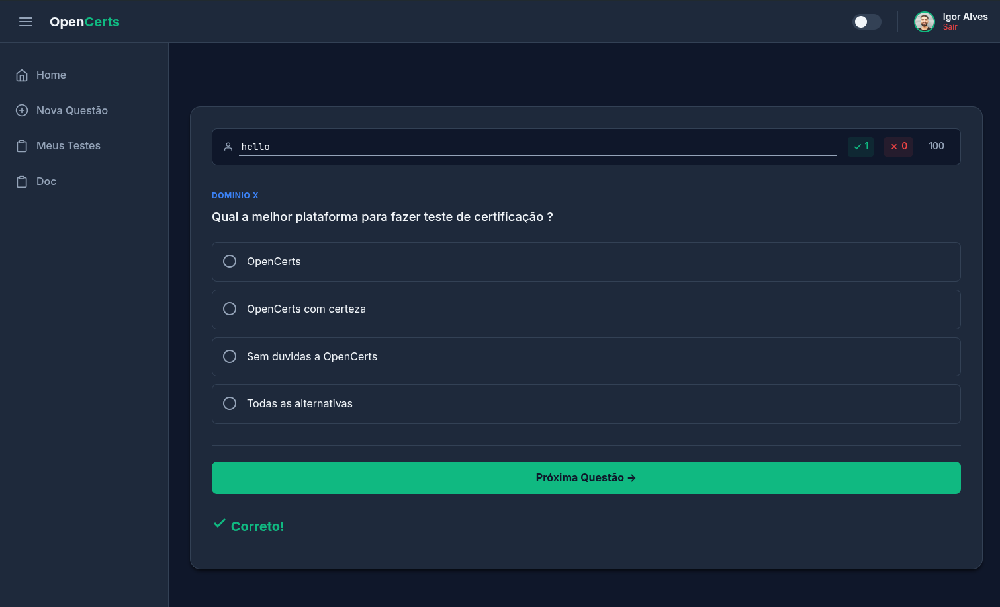

<!--
template_name=header-code
template_version=v1
-->

<h1 align="center" style="color:#F1F5F9;">
  OpenCerts
</h1>

  
    Uma plataforma open-source e colaborativa para preparação de certificações Cloud.
  

         

  

  
    🔧 No new features planned. Bugs and small fixes only.
  

  
   
  

    <strong>Estude, Pratique e Evolua.</strong> 
  

  

    <a href="#-sobre">Sobre</a> •
    <a href="#-features">Funcionalidades</a> •
    <a href="#-tecnologias">Tecnologias</a> •
  

---

## 🚀 Sobre

O **OpenCerts** é uma aplicação focada em desenvolvedores que buscam validação de conhecimento em nuvem (AWS, Azure, Google Cloud).

Diferente de plataformas complexas de quiz, o OpenCerts foca na **simplicidade** e na **repetição**. Com uma interface limpa, moderna e livre de distrações, você pode iniciar baterias de testes, salvar seu progresso através de *Session Identifiers* (sem necessidade de cadastro burocrático) e contribuir com novas questões para a comunidade.

## 📸 Screenshots

  
  

## ✨ Features

- **🎯 Foco em Certificações:** Organizado por provedor (AWS, etc.) e níveis (Foundational, Associate, Professional).
- **💾 Session Identifiers:** Um sistema único de "Save Game". Defina um ID (ex: `minha-sessao-01`) e continue seus estudos de onde parou em qualquer dispositivo.
- **⚡ Feedback Imediato:** Validação visual instantânea de acertos e erros com explicações detalhadas.
- **🌙 Dark Mode Nativo:** Interface desenvolvida com base no tema *Midnight Slate* para conforto visual durante longas sessões de estudo.
- **📱 Responsivo:** Estude no desktop ou no mobile com uma experiência fluida.
- **🤝 Colaborativo:** Ferramenta integrada para submissão de novas questões pela comunidade.

## 🛠 Tecnologias

O projeto é construído sobre uma base sólida e moderna de Java:

- **Backend:** Java 25+, Spring Boot 3.x
- **Frontend:** Thymeleaf (Server-side rendering)
- **Estilização:** CSS3 Moderno (Custom Properties / CSS Variables)
- **Ícones:** SVG (Inline e Feather/Heroicons style)
- **Build:** gradle
- **Banco de Dados:** MongoDB (NoSQL)

<!--
template_name=footer-default
template_version=v1
-->

---

  

---

  <strong style="font-size:16px;">Igor Moreira Alves</strong> 
  Back-end Software Engineer • Java • Python • Spring Boot • AWS

  
  
  

  
    Atualizado em 2026-02-14 11:59
  

